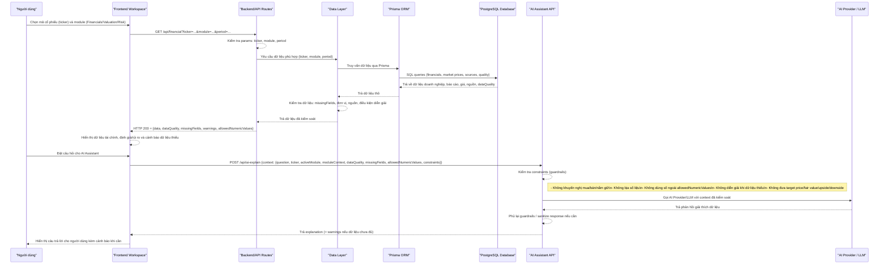

Chú thích (Tiếng Việt): Hình 3.x mô tả luồng chính khi người dùng chọn mã cổ phiếu, hệ thống truy xuất dữ liệu có kiểm soát (kiểm tra missingFields, units, nguồn và dataQuality), rồi người dùng hỏi AI Assistant. AI Assistant nhận context đã được kiểm soát, áp dụng guardrails (không khuyến nghị giao dịch, không bịa số liệu, không sử dụng số ngoài `allowedNumericValues`, không diễn giải khi thiếu dữ liệu) trước khi gọi LLM và trả lời.
