# Thiết kế cơ sở dữ liệu cuối cùng cho Atelier Finance

## 1. Mục tiêu thiết kế cơ sở dữ liệu

Cơ sở dữ liệu của Atelier Finance được thiết kế để hỗ trợ hệ thống web hỗ trợ ra quyết định đầu tư cổ phiếu dành cho nhà đầu tư cá nhân mới tại Việt Nam. Thiết kế tập trung vào khả năng truy vết nguồn, kiểm soát đơn vị đo, bảo toàn dữ liệu thiếu và cung cấp ngữ cảnh có căn cứ cho các chức năng giải thích. Hệ thống giúp người dùng đọc dữ liệu doanh nghiệp, tài chính, thị trường, định giá, rủi ro, vĩ mô và ngành; không cung cấp khuyến nghị giao dịch, tín hiệu giao dịch hoặc kết luận mang tính tư vấn đầu tư.

## 2. Nguyên tắc thiết kế

- `Company` là thực thể định danh trung tâm của dữ liệu ở cấp cổ phiếu. Dữ liệu báo cáo tài chính, giá thị trường và các tương tác có ngữ cảnh mã cổ phiếu đều tham chiếu đến thực thể này.
- Dữ liệu được tách thành ba lớp: dữ liệu nguồn và nhật ký nhập; dữ liệu nghiệp vụ đã chuẩn hóa; dữ liệu tương tác của người dùng. Cách tách này cho phép kiểm toán đường đi từ bản ghi nguồn đến dữ liệu được sử dụng trong phân tích.
- Dữ liệu vĩ mô và dữ liệu ngành là dữ liệu phân tích hỗ trợ, không phải chỉ tiêu thuộc báo cáo tài chính của một doanh nghiệp. Vì vậy, chúng được lưu trong các bảng độc lập.
- Đơn vị đo và nguồn gốc dữ liệu là siêu dữ liệu bắt buộc đối với các trường nhạy cảm về quy mô. Thiếu hoặc không hợp lệ về đơn vị, nguồn hay bằng chứng phải làm giảm trạng thái sẵn sàng và chặn phép tính liên quan.
- Giá trị chưa có phải giữ ở dạng `NULL`, `N/A` hoặc `needs_review`; không được thay bằng `0`. Các trường `missingFields`, `warningCodes`, `qualityStatus` và `readiness` giúp truyền trạng thái này đến tầng nghiệp vụ và giao diện.
- Cơ sở dữ liệu phục vụ giải thích, học tập và hỗ trợ hình thành luận điểm. Thiết kế không có trường tín hiệu giao dịch, giá mục tiêu, mức tăng/giảm kỳ vọng hoặc kết luận hành động đầu tư.

## 3. Nhóm bảng chính

### 3.1. Nhóm dữ liệu định danh

| Bảng | Mục đích | Trường chính | Khóa chính | Khóa ngoại và quan hệ | Module sử dụng |
|---|---|---|---|---|---|
| `User` | Lưu tài khoản và hồ sơ cơ bản của người dùng. | `email`, `displayName`, `createdAt`, `updatedAt` | `id` | Một người dùng có nhiều watchlist, phiên checklist, kịch bản mô phỏng và hội thoại AI. | Watchlist, Checklist, Simulation, AI Assistant |
| `Industry` | Danh mục ngành chuẩn hóa, độc lập với từng doanh nghiệp. | `industryCode`, `industryName`, `classificationSystem`, `description` | `id` | Quan hệ 1-N với `Company` và `IndustryMetric`. | Company, Overview, Industry, Risk, AI Assistant |
| `Company` | Thực thể trung tâm định danh tổ chức phát hành và mã cổ phiếu. | `ticker`, `exchange`, `companyName`, `companyType`, `country`, `currency`, `dataMode`, `profileAsOf` | `id` | `industryId` → `Industry.id`; `profileSourceId` → `DataSource.id`. Quan hệ 1-N với báo cáo tài chính, giá, watchlist, checklist, mô phỏng và hội thoại AI. | Company/Overview và mọi module phân tích theo mã cổ phiếu |

### 3.2. Nhóm dữ liệu nghiệp vụ theo cổ phiếu

| Bảng | Mục đích | Trường chính | Khóa chính | Khóa ngoại và quan hệ | Module sử dụng |
|---|---|---|---|---|---|
| `FinancialStatement` | Lưu dữ liệu tài chính chuẩn hóa theo kỳ; các chỉ tiêu chưa có được để `NULL`. | `periodType`, `period`, `fiscalYear`, `fiscalQuarter`, `reportDate`, `revenue`, `netIncome`, `totalAssets`, `equity`, `totalDebt`, `eps`, `bvps`, `sharesOutstanding`, `currency`, `sourceLabel`, `dataMode`, `productionApproved`, `qualityStatus`, `readiness`, `missingFields`, `warningCodes` | `id` | `companyId` → `Company.id`; `sourceId` → `DataSource.id`. Quan hệ 1-N với `FinancialStatementUnitMetadata`. | Overview, Financials, Valuation, Risk, Checklist, Watchlist, AI Assistant |
| `FinancialStatementUnitMetadata` | Ghi đơn vị và trạng thái kiểm tra theo từng trường tài chính, tránh suy đoán quy mô từ giá trị. | `field`, `unit`, `status`, `warningCodes`, `productionApproved` | `id` | `financialStatementId` → `FinancialStatement.id`; duy nhất theo cặp `(financialStatementId, field)`. | Financials, Valuation, Risk, Data Import, AI Assistant |
| `MarketPrice` | Lưu chuỗi OHLCV, giá trị giao dịch và vốn hóa theo ngày hoặc phiên. Đây là nguồn cho biểu đồ giá và PVT, không phải tín hiệu giao dịch. | `tradingDate`, `periodType`, `openPrice`, `highPrice`, `lowPrice`, `closePrice`, `previousClose`, `adjustedClosePrice`, `volume`, `tradingValue`, `marketCap`, `currency`, `sourceLabel`, `dataMode`, `productionApproved`, `qualityStatus`, `readiness`, `missingFields` | `id` | `companyId` → `Company.id`; `sourceId` → `DataSource.id`. Quan hệ 1-N với `MarketPriceUnitMetadata`. | Overview, Technical/Price Chart/PVT, Valuation, Risk, Simulation |
| `MarketPriceUnitMetadata` | Ghi đơn vị, thời điểm và trạng thái kiểm tra theo từng trường giá/PVT. | `field`, `unit`, `status`, `asOf`, `warningCodes`, `productionApproved` | `id` | `marketPriceId` → `MarketPrice.id`; duy nhất theo cặp `(marketPriceId, field)`. | Technical/PVT, Valuation, Data Import, AI Assistant |

**Quyết định đối với Valuation và Risk.** Hệ thống không tạo `ValuationSnapshot` hoặc `RiskSnapshot` làm nguồn dữ liệu chính. Các chỉ số định giá và yếu tố rủi ro được tính tại thời điểm truy vấn từ `FinancialStatement`, `MarketPrice`, dữ liệu vĩ mô/ngành cùng metadata về nguồn, đơn vị và chất lượng. Lựa chọn này tránh lưu kết quả dẫn xuất đã cũ hoặc làm cho một kết quả phân tích bị hiểu như khuyến nghị. Khi cần tái hiện một lần sử dụng cụ thể, đầu vào và trạng thái chất lượng được đóng băng trong `ChecklistResult`, `SimulationScenario` hoặc `AssistantMessage.contextSnapshot`.

### 3.3. Nhóm dữ liệu vĩ mô và ngành

| Bảng | Mục đích | Trường chính | Khóa chính | Khóa ngoại và quan hệ | Module sử dụng |
|---|---|---|---|---|---|
| `MacroIndicator` | Danh mục định nghĩa chỉ tiêu vĩ mô như tăng trưởng GDP, CPI, lãi suất chính sách, tỷ giá, tăng trưởng tín dụng và PMI. | `indicatorCode`, `indicatorName`, `description`, `frequency`, `defaultUnit`, `countryCode` | `id` | Quan hệ 1-N với `MacroIndicatorObservation`. Không có `companyId`. | Macro, Overview, Industry, Risk, AI Assistant |
| `MacroIndicatorObservation` | Lưu chuỗi thời gian của từng chỉ tiêu vĩ mô với kỳ, đơn vị, nguồn và trạng thái chất lượng rõ ràng. | `period`, `observedAt`, `asOf`, `value`, `unit`, `sourceLabel`, `dataMode`, `productionApproved`, `qualityStatus`, `readiness`, `missingFields`, `warningCodes` | `id` | `macroIndicatorId` → `MacroIndicator.id`; `sourceId` → `DataSource.id`. | Macro, Overview, Industry, Risk, AI Assistant |
| `IndustryMetric` | Lưu chỉ số và benchmark theo ngành, theo kỳ; ví dụ tăng trưởng doanh thu/lợi nhuận ngành, biên gộp, chỉ số ngành hoặc chỉ tiêu cung-cầu. | `metricCode`, `metricName`, `period`, `asOf`, `value`, `unit`, `benchmarkType`, `sourceLabel`, `dataMode`, `productionApproved`, `qualityStatus`, `readiness`, `missingFields` | `id` | `industryId` → `Industry.id`; `sourceId` → `DataSource.id`. | Industry, Overview, Valuation (benchmark), Risk, Checklist, AI Assistant |

`MacroIndicator` độc lập với `Company` vì một quan sát vĩ mô mô tả bối cảnh kinh tế chung và có thể ảnh hưởng đồng thời đến nhiều ngành, doanh nghiệp. `IndustryMetric` thuộc một `Industry`; doanh nghiệp liên kết với ngành thông qua `Company.industryId`. Nhờ đó, hệ thống có thể lấy benchmark phù hợp mà không sao chép cùng một chỉ tiêu ngành vào từng công ty hoặc ép nó vào `FinancialStatement`.

### 3.4. Nhóm dữ liệu kiểm soát nguồn, đơn vị và chất lượng dữ liệu

| Bảng | Mục đích | Trường chính | Khóa chính | Khóa ngoại và quan hệ | Module sử dụng |
|---|---|---|---|---|---|
| `DataSource` | Danh mục nguồn và chính sách sử dụng, gồm chủ sở hữu, phương thức truy cập và trạng thái pháp lý. | `name`, `sourceType`, `supportedDataGroups`, `usageStatus`, `licenseStatus`, `tosStatus`, `accessMethod`, `runtimeDisplayAllowed`, `cachingAllowed`, `redistributionAllowed`, `attributionText` | `id` | Quan hệ 1-N với `SourceEvidence`, dữ liệu nghiệp vụ, dữ liệu vĩ mô/ngành và `ImportJob`. | Data Import, mọi module hiển thị nguồn, AI Assistant |
| `SourceEvidence` | Lưu bằng chứng về tài liệu, điều khoản, giấy phép và kết quả rà soát của nguồn. | `homepageUrl`, `documentationUrl`, `licenseUrl`, `termsUrl`, các cờ quyền sử dụng, `evidenceStatus`, `reviewedAt`, `reviewedBy`, `risks`, `blockedReason` | `id` | `sourceId` → `DataSource.id`. | Data Governance, Data Import, AI Assistant |
| `ImportJob` | Đại diện một lần nhập hoặc đồng bộ dữ liệu; là phiên bản tổng quát hóa của hướng triển khai `ManualImportSession` hiện tại. | `jobType`, `mode`, `fileName`, `targetTicker`, `targetPeriod`, số lượng dòng, `status`, `readiness`, `startedAt`, `completedAt` | `id` | `userId` → `User.id` (tùy chọn); `sourceId` → `DataSource.id`. Quan hệ 1-N với `ManualImportRecord` và `DataQualityReport`. | Data Import, Data Governance |
| `ManualImportRecord` | Lưu vết từng dòng đầu vào, kết quả chuẩn hóa và liên kết đến bản ghi nghiệp vụ được tạo; dữ liệu preview/research không tự động được công nhận. | `rowIndex`, `rawPayload`, `normalizedPayload`, `targetEntityType`, `targetEntityId`, `ticker`, `period`, `dataMode`, `readiness`, `qualityStatus`, `warnings`, `errors`, `unmappedFields`, `missingFields` | `id` | `importJobId` → `ImportJob.id`; `companyId` → `Company.id` (tùy chọn). Có thể tham chiếu bản ghi chuẩn hóa qua `targetEntityType/targetEntityId`. | Data Import, Financials, Technical/PVT, audit nguồn |
| `DataQualityReport` | Tổng hợp độ phủ, trường thiếu, cảnh báo, lỗi và trạng thái sẵn sàng cho một job hoặc một phạm vi dữ liệu. | `scopeType`, `scopeId`, `qualityStatus`, `readiness`, `missingFields`, `warningCodes`, `errorCodes`, `fieldCoverage`, `topIssues`, `calculationVersion`, `generatedAt` | `id` | `importJobId` → `ImportJob.id` (tùy chọn); phạm vi nghiệp vụ được xác định bởi `scopeType/scopeId`. | Data Import, Overview, Checklist, AI Assistant |

Hai bảng metadata đơn vị được giữ riêng cho Financials và Market/PVT vì quyền sở hữu trường, quy tắc kiểm tra và thang đo của hai miền khác nhau. Với Macro và Industry, `unit` được lưu trực tiếp trên từng quan sát/metric cùng nguồn và trạng thái chất lượng, do mỗi bản ghi chỉ đại diện một chỉ tiêu.

### 3.5. Nhóm dữ liệu tương tác người dùng

| Bảng | Mục đích | Trường chính | Khóa chính | Khóa ngoại và quan hệ | Module sử dụng |
|---|---|---|---|---|---|
| `Watchlist` | Liên kết người dùng với công ty đang theo dõi và lưu ghi chú/luận điểm cá nhân. | `status`, `priority`, `notes`, `thesisSummary`, `dataMode`, `readiness` | `id` | `userId` → `User.id`; `companyId` → `Company.id`; duy nhất theo `(userId, companyId)`. | Watchlist, Overview |
| `ChecklistItem` | Danh mục câu hỏi/tiêu chí kiểm tra có phiên bản, gắn với module và loại bằng chứng cần thiết. | `itemCode`, `moduleKey`, `question`, `evidenceRule`, `displayOrder`, `version`, `isActive` | `id` | Quan hệ 1-N với `ChecklistResult`. | Checklist |
| `UserChecklist` | Một lần người dùng thực hiện checklist cho một công ty tại một thời điểm. | `status`, `startedAt`, `completedAt`, `summary`, `readiness`, `contextSnapshot` | `id` | `userId` → `User.id`; `companyId` → `Company.id`. Quan hệ 1-N với `ChecklistResult`. | Checklist, Watchlist, Simulation |
| `ChecklistResult` | Kết quả từng tiêu chí, gồm trạng thái, bằng chứng, trường thiếu và cảnh báo; không chứa kết luận giao dịch. | `status`, `answer`, `evidenceSnapshot`, `missingFields`, `warningCodes`, `evaluatedAt` | `id` | `userChecklistId` → `UserChecklist.id`; `checklistItemId` → `ChecklistItem.id`; duy nhất theo `(userChecklistId, checklistItemId)`. | Checklist, Simulation, AI Assistant |
| `SimulationScenario` | Lưu kịch bản học tập/mô phỏng và phản tư của người dùng, không phải lệnh giao dịch thật. | `scenarioType`, `title`, `assumptions`, `inputSnapshot`, `outcomeSnapshot`, `reflection`, `status`, `readiness`, `reviewedAt` | `id` | `userId` → `User.id`; `companyId` → `Company.id`. | Simulation, Checklist, Watchlist |
| `AssistantConversation` | Nhóm các lượt trao đổi AI theo người dùng, module và ngữ cảnh công ty tùy chọn. | `activeModule`, `title`, `tickerContext`, `createdAt`, `updatedAt` | `id` | `userId` → `User.id`; `companyId` → `Company.id` (tùy chọn). Quan hệ 1-N với `AssistantMessage`. | AI Assistant |
| `AssistantMessage` | Lưu từng tin nhắn, nguồn/ngữ cảnh đã dùng, số liệu được phép và kết quả kiểm tra guardrail. | `role`, `content`, `contextSnapshot`, `dataQualityContext`, `allowedNumericValues`, `sourceSummary`, `provider`, `guardrailStatus`, `createdAt` | `id` | `conversationId` → `AssistantConversation.id`. | AI Assistant, audit giải thích |

## 4. Sơ đồ ERD

```mermaid
erDiagram
    USER {
        String id PK
        String email UK
        String displayName
        DateTime createdAt
    }
    INDUSTRY {
        String id PK
        String industryCode UK
        String industryName
        String classificationSystem
    }
    COMPANY {
        String id PK
        String industryId FK
        String profileSourceId FK
        String ticker
        String exchange
        String companyName
        String dataMode
    }
    FINANCIAL_STATEMENT {
        String id PK
        String companyId FK
        String sourceId FK
        String period
        String periodType
        Decimal revenue
        Decimal netIncome
        Decimal totalDebt
        Decimal eps
        Boolean productionApproved
        String qualityStatus
        String missingFields
    }
    FINANCIAL_STATEMENT_UNIT_METADATA {
        String id PK
        String financialStatementId FK
        String field
        String unit
        String status
        Boolean productionApproved
    }
    MARKET_PRICE {
        String id PK
        String companyId FK
        String sourceId FK
        DateTime tradingDate
        Decimal closePrice
        Decimal volume
        Decimal marketCap
        Boolean productionApproved
        String qualityStatus
        String missingFields
    }
    MARKET_PRICE_UNIT_METADATA {
        String id PK
        String marketPriceId FK
        String field
        String unit
        String status
        Boolean productionApproved
    }
    MACRO_INDICATOR {
        String id PK
        String indicatorCode UK
        String indicatorName
        String frequency
        String defaultUnit
    }
    MACRO_INDICATOR_OBSERVATION {
        String id PK
        String macroIndicatorId FK
        String sourceId FK
        String period
        DateTime asOf
        Decimal value
        String unit
        Boolean productionApproved
        String qualityStatus
        String readiness
    }
    INDUSTRY_METRIC {
        String id PK
        String industryId FK
        String sourceId FK
        String metricCode
        String period
        DateTime asOf
        Decimal value
        String unit
        String benchmarkType
        Boolean productionApproved
        String qualityStatus
    }
    DATA_SOURCE {
        String id PK
        String name
        String sourceType
        String usageStatus
        String licenseStatus
        String accessMethod
    }
    SOURCE_EVIDENCE {
        String id PK
        String sourceId FK
        String documentationUrl
        String termsUrl
        String evidenceStatus
        DateTime reviewedAt
    }
    IMPORT_JOB {
        String id PK
        String userId FK
        String sourceId FK
        String jobType
        String status
        String readiness
        Int rowCount
    }
    MANUAL_IMPORT_RECORD {
        String id PK
        String importJobId FK
        String companyId FK
        Int rowIndex
        String rawPayload
        String normalizedPayload
        String targetEntityType
        String targetEntityId
        String qualityStatus
    }
    DATA_QUALITY_REPORT {
        String id PK
        String importJobId FK
        String scopeType
        String scopeId
        String qualityStatus
        String readiness
        String missingFields
    }
    WATCHLIST {
        String id PK
        String userId FK
        String companyId FK
        String status
        String thesisSummary
    }
    CHECKLIST_ITEM {
        String id PK
        String itemCode UK
        String moduleKey
        String question
        String evidenceRule
        Int version
    }
    USER_CHECKLIST {
        String id PK
        String userId FK
        String companyId FK
        String status
        String readiness
        String contextSnapshot
    }
    CHECKLIST_RESULT {
        String id PK
        String userChecklistId FK
        String checklistItemId FK
        String status
        String evidenceSnapshot
        String missingFields
    }
    SIMULATION_SCENARIO {
        String id PK
        String userId FK
        String companyId FK
        String scenarioType
        String assumptions
        String inputSnapshot
        String reflection
        String status
    }
    ASSISTANT_CONVERSATION {
        String id PK
        String userId FK
        String companyId FK
        String activeModule
        String tickerContext
        DateTime createdAt
    }
    ASSISTANT_MESSAGE {
        String id PK
        String conversationId FK
        String role
        String content
        String contextSnapshot
        String dataQualityContext
        String allowedNumericValues
        String guardrailStatus
    }

    INDUSTRY ||--o{ COMPANY : classifies
    INDUSTRY ||--o{ INDUSTRY_METRIC : has
    COMPANY ||--o{ FINANCIAL_STATEMENT : reports
    COMPANY ||--o{ MARKET_PRICE : has
    FINANCIAL_STATEMENT ||--o{ FINANCIAL_STATEMENT_UNIT_METADATA : describes
    MARKET_PRICE ||--o{ MARKET_PRICE_UNIT_METADATA : describes
    MACRO_INDICATOR ||--o{ MACRO_INDICATOR_OBSERVATION : observes
    DATA_SOURCE ||--o{ COMPANY : profiles
    DATA_SOURCE ||--o{ FINANCIAL_STATEMENT : provides
    DATA_SOURCE ||--o{ MARKET_PRICE : provides
    DATA_SOURCE ||--o{ MACRO_INDICATOR_OBSERVATION : provides
    DATA_SOURCE ||--o{ INDUSTRY_METRIC : provides
    DATA_SOURCE ||--o{ SOURCE_EVIDENCE : documented_by
    DATA_SOURCE ||--o{ IMPORT_JOB : feeds
    USER ||--o{ IMPORT_JOB : initiates
    IMPORT_JOB ||--o{ MANUAL_IMPORT_RECORD : contains
    IMPORT_JOB ||--o{ DATA_QUALITY_REPORT : produces
    COMPANY ||--o{ MANUAL_IMPORT_RECORD : targets
    USER ||--o{ WATCHLIST : owns
    COMPANY ||--o{ WATCHLIST : appears_in
    USER ||--o{ USER_CHECKLIST : performs
    COMPANY ||--o{ USER_CHECKLIST : assessed_in
    USER_CHECKLIST ||--o{ CHECKLIST_RESULT : contains
    CHECKLIST_ITEM ||--o{ CHECKLIST_RESULT : answered_by
    USER ||--o{ SIMULATION_SCENARIO : creates
    COMPANY ||--o{ SIMULATION_SCENARIO : contextualizes
    USER ||--o{ ASSISTANT_CONVERSATION : owns
    COMPANY ||--o{ ASSISTANT_CONVERSATION : contextualizes
    ASSISTANT_CONVERSATION ||--o{ ASSISTANT_MESSAGE : contains
```

## 5. Quan hệ giữa module chức năng và bảng dữ liệu

Không phải mỗi module giao diện tương ứng với một bảng. `Overview` tổng hợp định danh công ty, báo cáo tài chính, giá thị trường, dữ liệu vĩ mô, ngành và chất lượng dữ liệu. `Valuation` và `Risk` tính toán có kiểm soát từ dữ liệu chuẩn hóa thay vì đọc một kết luận lưu sẵn. `Checklist` kết hợp định nghĩa câu hỏi với bằng chứng từ nhiều module; AI Assistant đọc ngữ cảnh đã giới hạn rồi lưu hội thoại và ảnh chụp ngữ cảnh để truy vết. Macro và Industry cần bảng riêng vì chúng chứa chuỗi thời gian và benchmark không thuộc sở hữu của một báo cáo tài chính doanh nghiệp. Do đó, ERD được tổ chức theo thực thể dữ liệu và quan hệ nghiệp vụ, không theo số lượng màn hình của hệ thống.

## 6. Đoạn mô tả dùng trong khóa luận

Cơ sở dữ liệu Atelier Finance được thiết kế theo hướng chuẩn hóa, lấy `Company` làm thực thể trung tâm cho dữ liệu ở cấp cổ phiếu và tách biệt dữ liệu nguồn, dữ liệu nghiệp vụ cùng dữ liệu tương tác người dùng. Báo cáo tài chính và giá thị trường được lưu theo kỳ kèm metadata về đơn vị, nguồn gốc, thời điểm và chất lượng; các giá trị chưa có được bảo toàn ở trạng thái `NULL` hoặc cần rà soát thay vì thay thế bằng số 0. Dữ liệu vĩ mô được mô hình hóa thành danh mục chỉ tiêu và chuỗi quan sát độc lập, trong khi dữ liệu ngành liên kết với `Industry` để cung cấp chỉ số và benchmark phù hợp cho các doanh nghiệp cùng ngành. Các chức năng Overview, Valuation, Risk và Checklist tổng hợp hoặc tính toán từ những thực thể này, không tạo ra tín hiệu hay khuyến nghị giao dịch. AI Assistant sử dụng ngữ cảnh có kiểm soát từ cơ sở dữ liệu, kèm nguồn, đơn vị và trạng thái chất lượng để hỗ trợ giải thích; trợ lý không thay thế nguồn dữ liệu gốc và không được tự tạo số liệu ngoài ngữ cảnh đã cung cấp.
