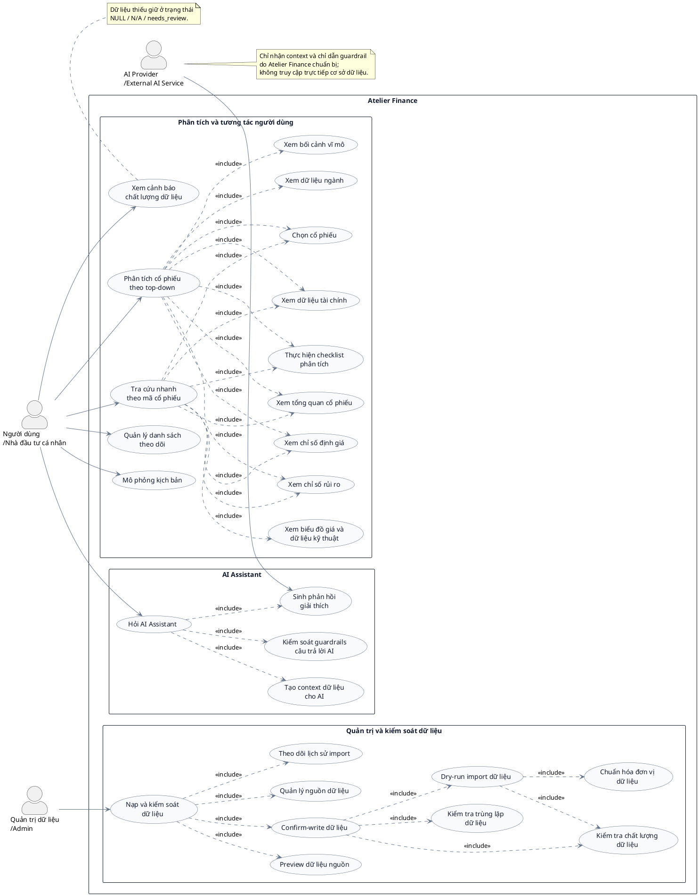

# Thiết kế Use Case cuối cùng cho Atelier Finance

## 1. Mục tiêu của sơ đồ use case

Sơ đồ use case mô tả các tương tác chức năng chính giữa tác nhân và hệ thống Atelier Finance. Hệ thống hỗ trợ nhà đầu tư cá nhân mới tiếp cận dữ liệu cổ phiếu theo quy trình, hiểu bối cảnh vĩ mô, ngành, doanh nghiệp, tài chính, thị trường, định giá và rủi ro trước khi tự hình thành nhận định. Các chức năng được thiết kế theo hướng hỗ trợ giải thích và ra quyết định có căn cứ; hệ thống không cung cấp khuyến nghị mua, bán, nắm giữ, tín hiệu giao dịch hoặc kết luận tư vấn đầu tư.

Thiết kế được xây dựng theo kiến trúc chức năng của hệ thống: không gian phân tích theo module tại workspace, dịch vụ dữ liệu và kiểm tra readiness, luồng import preview–dry-run–confirm, metadata về nguồn và đơn vị, cùng AI Assistant sử dụng context đã được giới hạn và kiểm soát guardrail.

## 2. Các tác nhân của hệ thống

### Người dùng / Nhà đầu tư cá nhân

Đây là tác nhân chính của hệ thống. Người dùng có thể bắt đầu từ bối cảnh vĩ mô và ngành hoặc truy cập trực tiếp theo mã cổ phiếu; sau đó xem tổng quan, dữ liệu tài chính, biểu đồ giá/PVT, chỉ số định giá, yếu tố rủi ro và checklist phân tích. Người dùng cũng quản lý danh sách theo dõi, xây dựng kịch bản mô phỏng, xem cảnh báo chất lượng dữ liệu và đặt câu hỏi cho AI Assistant.

### Quản trị dữ liệu / Admin

Tác nhân này chịu trách nhiệm vận hành luồng dữ liệu có kiểm soát: xem trước dữ liệu nguồn, chạy thử quá trình nhập, xác nhận ghi dữ liệu, chuẩn hóa đơn vị, phát hiện trùng lặp, quản lý nguồn và bằng chứng nguồn, kiểm tra chất lượng, đồng thời theo dõi lịch sử import. Admin không được bỏ qua bước kiểm tra để đưa dữ liệu chưa đủ căn cứ vào luồng sử dụng chính thức.

### AI Provider / External AI Service

Đây là dịch vụ bên ngoài được Atelier Finance gọi để sinh nội dung giải thích. AI Provider chỉ nhận context, số liệu được phép sử dụng và chỉ dẫn guardrail do hệ thống chuẩn bị. Tác nhân này không truy cập trực tiếp cơ sở dữ liệu và không tự lựa chọn dữ liệu nguồn. Phản hồi trả về tiếp tục được hệ thống kiểm tra trước khi hiển thị cho người dùng.

## 3. Nhóm use case của người dùng

- **Phân tích cổ phiếu theo tiếp cận top-down:** tổ chức hành trình từ xem bối cảnh vĩ mô, xem dữ liệu ngành, chọn cổ phiếu, xem tổng quan và tài chính đến định giá, rủi ro và checklist.
- **Tra cứu nhanh theo mã cổ phiếu:** cho phép người dùng đã biết ticker đi thẳng đến cổ phiếu cần xem, sau đó truy cập Overview, Financials, Technical/PVT, Valuation, Risk và Checklist.
- **Xem bối cảnh vĩ mô:** xem các chỉ tiêu và xu hướng như tăng trưởng, lạm phát, lãi suất, tỷ giá hoặc tín dụng cùng kỳ dữ liệu, đơn vị và nguồn.
- **Xem dữ liệu ngành:** xem đặc điểm ngành, yếu tố tác động, chỉ tiêu ngành, benchmark và nhóm doanh nghiệp đại diện.
- **Tìm kiếm/chọn cổ phiếu:** chọn ticker và công ty làm ngữ cảnh thống nhất cho các module phân tích.
- **Xem tổng quan cổ phiếu:** tổng hợp định danh doanh nghiệp, trạng thái dữ liệu và mức sẵn sàng của các module.
- **Xem dữ liệu tài chính:** đọc báo cáo tài chính theo kỳ, chỉ tiêu dẫn xuất an toàn, trường thiếu, đơn vị và nguồn dữ liệu.
- **Xem biểu đồ giá và dữ liệu kỹ thuật:** quan sát chuỗi giá, khối lượng và PVT nhằm hỗ trợ đọc hành vi thị trường, không tạo tín hiệu giao dịch.
- **Xem chỉ số định giá:** xem các chỉ số có thể tính từ đầu vào hợp lệ; phép tính bị chặn khi thiếu dữ liệu hoặc không rõ đơn vị.
- **Xem chỉ số rủi ro:** xem yếu tố rủi ro, trường dữ liệu còn thiếu và câu hỏi cần kiểm tra; kết quả không được diễn giải thành mức độ an toàn để hành động đầu tư.
- **Thực hiện checklist phân tích:** rà soát có cấu trúc các khía cạnh vĩ mô, ngành, doanh nghiệp, tài chính, định giá, kỹ thuật và rủi ro.
- **Quản lý danh sách theo dõi:** thêm, cập nhật trạng thái và ghi chú cho các cổ phiếu cần tiếp tục quan sát.
- **Mô phỏng kịch bản:** ghi nhận giả định, dữ liệu đầu vào, tình huống và phần phản tư trong môi trường học tập, không tạo lệnh giao dịch thật.
- **Hỏi AI Assistant:** yêu cầu giải thích dữ liệu hoặc thuật ngữ dựa trên context của module đang mở.
- **Xem cảnh báo chất lượng dữ liệu:** nhận biết dữ liệu thiếu, dữ liệu mẫu/fallback, nguồn chưa được phê duyệt, đơn vị chưa rõ hoặc trạng thái `needs_review`.

Hai use case đầu không trùng lặp. Chúng biểu diễn hai điểm vào và trình tự tương tác khác nhau: top-down định hướng người dùng đi từ bối cảnh chung đến cổ phiếu cụ thể, còn stock-first phục vụ tình huống người dùng đã có mã cổ phiếu cần phân tích.

## 4. Nhóm use case của quản trị dữ liệu

- **Preview dữ liệu nguồn:** đọc bản xem trước và metadata mà chưa ghi vào dữ liệu nghiệp vụ.
- **Dry-run import dữ liệu:** chạy parser, ánh xạ, chuẩn hóa và kiểm tra toàn bộ lô dữ liệu trong chế độ không ghi.
- **Confirm-write dữ liệu:** chỉ ghi các bản ghi vượt qua điều kiện kiểm tra sau khi Admin xác nhận rõ ràng.
- **Chuẩn hóa đơn vị dữ liệu:** xác định đơn vị tường minh cho từng trường nhạy cảm về quy mô; không suy đoán đơn vị theo độ lớn số.
- **Kiểm tra trùng lặp dữ liệu:** phát hiện bản ghi cùng ticker, kỳ, ngày hoặc nguồn để tránh ghi lặp không chủ đích.
- **Quản lý nguồn dữ liệu:** quản lý nhãn nguồn, loại nguồn, phương thức truy cập, điều khoản, bằng chứng và phạm vi sử dụng.
- **Kiểm tra chất lượng dữ liệu:** tổng hợp trường thiếu, cảnh báo, lỗi, độ phủ và trạng thái sẵn sàng; giá trị thiếu không được đổi thành số 0.
- **Theo dõi lịch sử import:** tra cứu job/phiên import, số dòng hợp lệ, cảnh báo, lỗi, bản ghi đã bỏ qua và kết quả ghi.

Các use case trên tạo thành hàng rào kiểm soát trước khi dữ liệu đi vào lớp nghiệp vụ. `Confirm-write` bắt buộc bao gồm dry-run, kiểm tra chất lượng và kiểm tra trùng lặp; dry-run tiếp tục bao gồm chuẩn hóa đơn vị và kiểm tra chất lượng. Nhờ đó, nguồn gốc và lịch sử biến đổi của dữ liệu có thể được truy vết, trong khi dữ liệu research/manual/provider/PDF-preview không tự động được xem là đã phê duyệt.

## 5. Nhóm use case liên quan đến AI Assistant

- **Hỏi AI Assistant:** do người dùng khởi tạo từ ngữ cảnh module và ticker hiện tại.
- **Tạo context dữ liệu cho AI:** hệ thống chọn dữ liệu liên quan, nguồn, kỳ, `missingFields`, trạng thái chất lượng và danh sách số liệu được phép sử dụng.
- **Kiểm soát guardrails câu trả lời AI:** hệ thống áp dụng chỉ dẫn và kiểm tra đầu ra để ngăn số liệu không có căn cứ, khuyến nghị giao dịch hoặc kết luận vượt quá dữ liệu.
- **Sinh phản hồi giải thích:** AI Provider tạo nội dung từ context đã chuẩn bị; phản hồi chỉ mang tính giải thích dữ liệu và khái niệm.

Use case “Hỏi AI Assistant” bao gồm ba use case còn lại. Cơ sở dữ liệu và dịch vụ nội bộ của Atelier Finance chuẩn bị context trước khi gọi provider. AI Provider không tự truy vấn cơ sở dữ liệu, không thay thế dữ liệu nguồn và không đóng vai trò cố vấn đầu tư.

## 6. Use case diagram tổng quát

Sơ đồ tổng quát thể hiện đầy đủ ba nhóm chức năng và các quan hệ `include`. Khi trình bày trên khổ giấy có chiều ngang hạn chế, có thể tách thêm ba hình phóng to: nhóm use case người dùng, nhóm quản trị dữ liệu và nhóm AI Assistant; sơ đồ tổng quát vẫn được giữ để thể hiện ranh giới toàn hệ thống.

## 7. Bảng mô tả các use case chính

| Mã use case | Tên use case | Tác nhân chính | Mục tiêu | Kết quả đầu ra |
|---|---|---|---|---|
| UC01 | Phân tích cổ phiếu theo tiếp cận top-down | Người dùng | Đi từ bối cảnh Macro và Industry đến công ty, tài chính, định giá, rủi ro và checklist. | Hồ sơ phân tích có trình tự, kèm trạng thái dữ liệu và vấn đề cần kiểm tra. |
| UC02 | Tra cứu nhanh theo mã cổ phiếu | Người dùng | Truy cập trực tiếp một ticker đã biết và mở các module phân tích liên quan. | Tổng quan cùng dữ liệu Financials, Technical/PVT, Valuation, Risk và Checklist của ticker. |
| UC03 | Xem dữ liệu tài chính | Người dùng | Đọc chỉ tiêu tài chính theo kỳ với đơn vị, nguồn và trạng thái chất lượng. | Bảng/chỉ số tài chính, trường thiếu, cảnh báo và readiness. |
| UC04 | Xem định giá và rủi ro | Người dùng | Xem chỉ số định giá có thể tính và các yếu tố rủi ro từ đầu vào hợp lệ. | Chỉ số khả dụng, phép tính bị chặn, yếu tố rủi ro và giới hạn diễn giải. |
| UC05 | Hỏi AI Assistant | Người dùng | Nhận giải thích có căn cứ theo module và ticker hiện tại. | Phản hồi giải thích đã qua guardrail, kèm ngữ cảnh nguồn và chất lượng phù hợp. |
| UC06 | Quản lý danh sách theo dõi | Người dùng | Lưu cổ phiếu cần quan sát, trạng thái và ghi chú phân tích. | Danh sách theo dõi được cập nhật, không chứa kết luận giao dịch của hệ thống. |
| UC07 | Mô phỏng kịch bản | Người dùng | Thử nghiệm giả định và ghi lại phản tư trong môi trường học tập. | Kịch bản, input snapshot, kết quả quan sát và ghi chú hậu kiểm. |
| UC08 | Nạp và kiểm soát dữ liệu | Quản trị dữ liệu | Đưa dữ liệu vào hệ thống qua preview, dry-run, chuẩn hóa, kiểm tra và xác nhận ghi. | Nhật ký import, bản ghi hợp lệ/được bỏ qua, báo cáo chất lượng và provenance. |

## 8. Hai hướng tiếp cận top-down và stock-first

Hướng **top-down** được sử dụng khi người dùng bắt đầu bằng việc tìm hiểu bối cảnh kinh tế vĩ mô, sau đó thu hẹp xuống ngành, chọn doanh nghiệp và tiếp tục với tài chính, định giá, rủi ro cùng checklist. Hướng **stock-first** phù hợp khi người dùng đã biết ticker và muốn truy cập trực tiếp Overview trước khi mở Financials, Technical/PVT, Valuation, Risk và Checklist.

Hai luồng sử dụng cùng dịch vụ dữ liệu, cơ sở dữ liệu, metadata nguồn/đơn vị và các quy tắc kiểm soát chất lượng. Khác biệt nằm ở điểm vào và thứ tự tương tác, vì vậy cả hai được biểu diễn riêng trong sơ đồ use case thay vì gộp thành một hành vi duy nhất.

## 9. Đoạn mô tả dùng trong khóa luận

Sơ đồ use case của Atelier Finance mô tả ba tác nhân gồm người dùng, quản trị dữ liệu và dịch vụ AI bên ngoài trong phạm vi một hệ thống hỗ trợ phân tích cổ phiếu. Người dùng có thể thực hiện quy trình top-down từ Macro, Industry đến doanh nghiệp, tài chính, định giá, rủi ro và checklist, hoặc sử dụng luồng stock-first để truy cập trực tiếp theo mã cổ phiếu. Các chức năng watchlist và mô phỏng hỗ trợ lưu vết quá trình quan sát, trong khi AI Assistant cung cấp giải thích dựa trên context, nguồn và trạng thái chất lượng do hệ thống chuẩn bị, không đóng vai trò cố vấn đầu tư. Nhóm quản trị dữ liệu thực hiện preview, dry-run, chuẩn hóa đơn vị, kiểm tra trùng lặp, kiểm soát chất lượng và xác nhận ghi nhằm bảo đảm khả năng truy vết trước khi dữ liệu được sử dụng trong các module phân tích.
